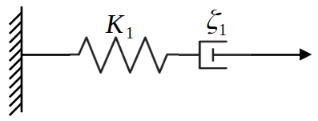
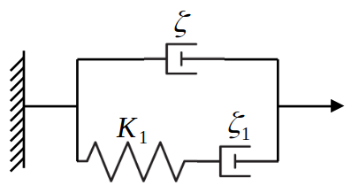
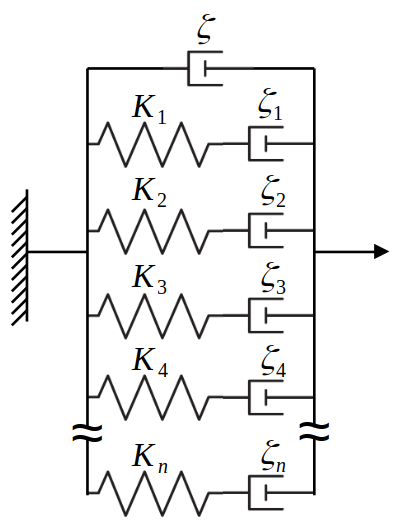
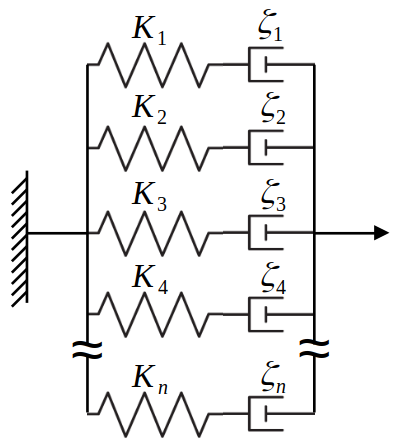

# VEspresso - ViscoElastic Espresso

This version of Espresso introduces a non-newtonian carrier medium using the non-linear Generalized Langevin Equation.

## Generalized Langevin Equation

Following *Andrew D. Baczewski and Stephen D. Bond, Numerical Integration of the Extended Variable Generalized Langevin Equation with a
Positive Prony Representable Memory Kernel*.

The **General Langevin Equation (GLE)** explains the movement of a particle for more general viscoelastic fluids and solids. We thus assume an arbitrary form of the resistance which will be given by a typical Newtonian component plus a viscoelastic contribution determined by its memory function $`\Gamma (t-t')`$.

```math
\begin{dcases}
m \frac{d\bf{v}}{dt} = \mathbf{F^c}(\mathbf{x}(t)) -\zeta \mathbf{v}(t) + \mathbf{F^r_N} (t) - \int_{0}^{t}{\Gamma_m (t-t') \mathbf{v}(t')dt'} + \mathbf{F^r}(t) \\
\mathbf{v(t)} = \frac{d\mathbf{x}(t)}{dt}
\end{dcases}
```

with initial conditions $`\mathbf{x}(0) = \mathbf{x_0}`$ and $`\mathbf{v}(0) = \mathbf{v_0}`$. $`F^c`$ is a conservative force and $`F^r_N`$ and $`F^r`$ are Newtonian and viscoelastic random forces respectively, that must satisfy the Fluctuation-Dissipation Theorem (FDT):

```math
\langle F_{N, i}^r(t') F_{N, j}^r(t) \rangle = 2 \zeta k_B T \; \delta(t-t') \; \delta_{ij}
```

```math
\langle F_i^r(t') F_j^r(t) \rangle = k_B T \; \Gamma_m (t-t') \; \delta_{ij}
```

Subscripts $`i`$ and $`j`$ denote the different components of the vector.

In order to solve this general equation with correlated noise, we assume that the memory kernel function can be represented as a Prony series of decaying exponentials with $`N_m`$ terms.

```math
\Gamma_m (t) = \sum_{m=1}^{N_m}{\mathrm{K}_m \exp[-t / \tau_m]} \; \; \; \;\text{ for } t \ge 0
```

where $`\mathrm{K}_m`$ and $`\tau_m`$ are fitting parameters. We will discuss in following sections how to obtain these fitting parameters. We can now define an extended variable $`Z_{i,m} (t)`$:

```math
Z_{i,m}(t) = - \int_{0}^{t}{\exp[- (t - t') / \tau_m] v_i (t') dt'} 
```

and making use of $`Z_{i,k} (t)`$ we can rewrite the GLE for each spatial component:

```math
\begin{dcases}
m dv_i = F_i^c (\mathbf{x}(t))dt -\zeta v_i (t) dt + F^r_{N,i} (t) dt + \sum_{m=1}^{N_m}{\mathrm{K}_m Z_{i,m} (t) dt} + F_i^r (t) dt \\
dx_i (t) = v_i (t) dt
\end{dcases}
```

Now, instead of writing $`Z_{i,k} (t)`$ in integral form, we can write it in differential form to obtain a Stochastical Differential Equation (SDE).

```math
dZ_{i,m} (t) = - \frac{1}{\tau_m} Z_{i,m} (t) dt - v_i (t) dt
```

This way, we can couple this equation with the previous set and solve them as a system, obtaining $`x_i`$, $`v_i`$ and $`z_{i,k}`$ without the need of computing the integral.

Let us now face the contribution of the random force $`F^r`$ to make it obey the FDT. To this end, we consider the following SDE

```math
df_{i,m} (t) = - \frac{1}{\tau_m} f_{i,k} (t) dt + \sqrt{2 k_B T / \zeta_m} dW_{i,m} (t) \; \; ,
```

with $`\zeta_m = \tau_m \mathrm{K}_m`$. If $`W_{i,m}`$ is a standard Wiener process, this SDE corresponds to an Ornstein-Uhlenbeck (OU) process. Using the OU properties, one can see that:

```math
\langle f_{i,m} (t') f_{i,m} (t) \rangle = \frac{k_B T}{\mathrm{K}_m} \exp[-(t-t') / \tau_m]
```

and we can straightforwardly write:

```math
F_i^r (t) = \sum_{k=m}^{N_m}{\mathrm{K}_m f_{i,m} (t)}
```

Combining both results, we can define the final extended variable $`U_{i,m} (t) = Z_{i,m} (t) + f_{i,m} (t)`$ and achieve a final expression for our set of equations:

```math
\begin{dcases}
m dv_i = F_i^c (\mathbf{x}(t))dt -\zeta v_i (t) dt + F^r_{N,i} (t) dt + \sum_{m=1}^{N_m}{\mathrm{K}_m U_{i,m} (t) dt} \\
dx_i (t) = v_i (t) dt \\
dU_{i,m} (t) = - \frac{1}{\tau_m} U_{i,m} (t) dt - v_i (t) dt + \sqrt{2 k_B T / \zeta_m} dW_{i,k} (t)
\end{dcases}
```

It can be shown, that in the limit of small $`\tau_k`$, the GLE converges to a typical Langevin equation.

### Physical interpretation

The simplest way of modelling the viscoelastic behavior of non-Newtonian fluids is their treatment as combinations of two basic elements: 

* Dampers, representing viscous friction, which exert a force $`f_{\zeta} = - \zeta \dot{x}`$.
  
* Springs, standing for elastic restoring forces, with a general form $`f_{\mathrm{K}} = - \mathrm{K} x`$


As seen in the previous derivation, our memory function must be decomposed in a series of decaying exponentials. A single exponential kernel function, without the extra Newtonian contribution, is one of the simplest viscoelastic models, a **Maxwell fluid**, which corresponds to a viscous damper and a elastic element connected sequentially.

```math
\Gamma (t) = \frac{\zeta_m}{\tau_m} \exp{(-t / \tau_m)} 
```

where $`\zeta_m`$ is the Maxwellian viscous friction coefficient, and $`\tau_m`$ is the relaxation time, the ratio of viscous and elastic coefficients $`\tau_m = \zeta_m / \mathrm{K}_m`$.

<center>

</center>

The addition of the Newtonian element leads to the so called **Jeffreys model**: a Maxwell chain connected in parallel with a purely viscous element.

```math
\Gamma (t) = 2 \, \zeta \, \delta (t) + \frac{\zeta_m}{\tau_m} \exp{(-t / \tau_m)} 
```

<center>

</center>

This way, expressing our memory function as sum of exponentials takes us to a **Generalized Jeffreys model** (also usually called Generalized Maxwell model), that is, a Newtonian viscous element to an arbitrary number $`N_m`$ of Maxwell elements.

```math
\Gamma(t) = 2 \, \zeta \, \delta (t) + \sum_{m=1}^{N_m}{\frac{\zeta_m}{\tau_m} \exp{(-t / \tau_m)}}
```

<center>

</center>

Therefore, the Generalized Langevin Equation approach is exact when the memory kernel is a sum of exponential, but provides a very efficient and accurate method to treat arbitrary memory functions as long as they can be fitted to an exponential sum. This decomposition is specially useful, for example, in **power-law scaling memory kernels**.

```math
\Gamma (t) = K t^{-n} \approx \sum_{m=1}^{N_m}{\frac{\zeta_m}{\tau_m} \exp{(-t / \tau_m)}}
```

This power-law rheology is usually observed in many complex materials such as biofluids, foods, cross-linked polymers, microgels, and hydrogels.

<center>

</center>

Another typical memory kernel is the **Rouse model**, another bead-spring model representative of diluted flexible polymers in Newtonian solvents. This model is just a sum of exponentials over the relaxation of the chain's normal modes, without any Newtonian contribution:

```math
\Gamma = n k_B T \zeta \sum_{p=1}^{N} \exp{(-t / \tau_p)}
```

with $`\tau_p = \frac{\zeta b^2 N^2}{6 \pi^2 k_B T p^2}`$.

## Equation integration

#### Velocity Verlet scheme 

We assume a constant timestep $`\Delta t`$ and we will use the notation $`x_i (n\Delta t) = x_i^n`$. Therefore, having the values $`x_i^n`$, $`v_i^n`$ and $`s_{i,k}^n`$, we will update to the $`(n+1)`$th time step following this method:

1. Update $`v_i`$ by a half step:
```math
   v_i^{n+1/2} = v_i^n + \frac{\Delta t}{2 m} F_i^c(x^n) + \frac{\Delta t}{2 m} \left( -\zeta v_i^n + \sqrt{\frac{2 k_B T \zeta}{\Delta t}} B_{i,N}^n + \sum_{m=1}^{N_m}{\mathrm{K}_m U_{i,m}^n} \right)
```
2. Update $`x_i`$ by a full step:
```math
   x_i^{n+1} = x_i^n + \Delta t \; v_i^{n+1/2}
```
3. Update the forces and the viscoelastic contribution $`U_{i,m}`$ a by a full step with the new positions and velocities:
```math
   U_{i,m}^{n+1} = U_{i,m}^n - \left(\frac{1}{\tau_m} U_{i,m}^n + v_i^{n+1/2} - \sqrt{\frac{2 k_B T}{\zeta_m \, \Delta t}} B_{i,m}^n \right) \Delta t
```
4. Update $`v_i`$ by another half step:
```math
   v_i^{n+1} = v_i^{n+1/2} + \frac{\Delta t}{2 m} F_i^c(x^{n+1}) + \frac{\Delta t}{2 m} \left( -\zeta v_i^{n+1} + \sqrt{\frac{2 k_B T \zeta}{\Delta t}} B_{i,N}^{n+1} + \sum_{m=1}^{N_m}{\mathrm{K}_m U_{i,m}^{n+1}} \right)
```

$`B_{i,N}^n`$ and $`B_{i,m}^n`$ are uncorrelated random numbers chosen from a Gaussian distribution of zero mean and variance unity $`N(0,1)`$.

#### Brownian dynamics scheme

This scheme is not recommended in a general situation. It is only applicable if a Newtonian friction is present, and introduces a numerical error because $`U_m`$ is velocity dependent. This integration scheme consists of the following steps:

1. Update of the viscoelastic contribution
```math
   U_{i,m}^{n+1} = U_{i,m}^n - \left(\frac{1}{\tau_m} U_{i,m}^n + v_i^{n} - \sqrt{\frac{2 k_B T}{\zeta_m \, \Delta t}} B_{i,m}^n \right) \Delta t
```
2. Force computation:
```math
   F_i^{n+1} = \left( F_i^c(x^n) + \sqrt{\frac{2 k_B T \zeta}{\Delta t}} B_{i,N}^{n} + \sum_{m=1}^{N_m}{\mathrm{K}_m U_{i,m}^{n+1}} \right)
```
3. Position update
```math
   x_i^{n+1} = x_i^n + \frac{F^{n+1}_i \Delta t}{\zeta} 
```
4. Velocity update
```math
   v_i^{n+1} = \frac{x_i^{n+1} - x_i^n}{\Delta t}  
```

## Non-linearity

All the previously discussed viscoelastic models, are restricted within the linear response limit, but many interesting properties emerge in when considering the non-linear rheology of materials. Among these properties, we can point shear rate-dependent viscosity (shear-thinning or thickening), yield stresses or even normal stress differences.

To implement these non-linearities in the Langevin Equation, a few models have been developed. Some of them, comprise the introduction of negative memory functions [[Ref]](https://doi.org/10.1038/s41467-018-03345-2), but it is a purely phenomenologycal fitting approach. Here we will follow the approach introduced by [I. Goychunk](https://doi.org/10.1073/pnas.2205637119), which is a non-linear Generalized Jeffreys-Langeving model, where the spring and damper constants are velocity dependent: $`\mathrm{K}_m (v)`$ and $`\zeta_m (t)`$.

```math
\begin{dcases}
\mathbf{v(t)} = \frac{d\mathbf{x}(t)}{dt} \\
m \frac{d\mathbf{v} (t)}{dt} = \mathbf{F^c}(\mathbf{x}(t)) -\zeta \mathbf{v}(t) + \mathbf{F^r_N} (t) + \sum_{m=1}^{N_m}{\mathrm{K}_m (v) \, \mathbf{U_{m}} (t)} \\
\frac{d\mathbf{U_{m}} (t)}{dt} = - \frac{1}{\tau_m (v)} \mathbf{U_{m}} (t) - \mathbf{v} (t) + \sqrt{2 k_B T / \zeta_m (v)} \mathbf{\xi_m} (t)
\end{dcases}
```

where it is shown that the relaxation time can also be velocity dependent. A basic case of this model, implemented in this version of Espresso, consists on a constant relaxation time $\tau_m (v) = \tau_m$, and a friction coefficient following a particular case of the Carreau-Yasuda model.

```math
\zeta_m (v) = \frac{\zeta_{m0}}{(1 + |v/v_c|^b)^a}
```

where the model parameters are: $`\zeta_{m0}`$, the zero-shear viscous friction coefficient, $`v_c`$, the critical velocity that marks the transition between constant and power-law viscosity, $`a`$ and $`b`$ the scaling exponents of the model.

Lastly, it can be shown that for vanishingly small relaxation times $`\tau_m \rightarrow 0`$, this model reduces to a classical Langevin equation with a viscosity that is non-linear in velocity:

```math
m \frac{d\mathbf{v} (t)}{dt} = \mathbf{F^c}(\mathbf{x}(t)) -\zeta_\text{{eff}} (v) \mathbf{v}(t) + \mathbf{F^r_N} (v,t)
```

with a friction coefficient 

```math
\zeta_\text{{eff}} (v) = \zeta + \sum_{m=1}^{N_m} {\zeta_m (v)}
```


## Espresso implementation

This Espresso version works in the same fashion of the main version. To include carrier medium viscoelasticity, it is mandatory to set a thermostat. In case you do not want to include brownian motion, just set ```kT = 0```. Along with the thermostat, we need to define the involved parameters in viscoelasticity and pass them to Espresso through the python interface.

The viscoelastic parameters have been introduced in Espresso as particle properties so that they can be individually defined. However, for monodisperse particles in isotropic mediums, parameters are expected to take the same value for all the particle set. We detail bellow the list of new parameters and their implications.

* **```Nm```** &nbsp; (int) Number of Prony modes. This variable defines how many decaying exponentials must will be fitted to the memory function. A maximum of $`N_m = 20`$ modes are allowed.
* **```visc_gamma```** &nbsp; (array of length 20) Viscoelastic friction coefficients $`\zeta_{m0}`$. Espresso will consider only the first Nm elements of the vector, the rest should be set to zero. This Espresso version will only consider viscoelasticity if at least the first value of this vector is not zero and $`N_m \ge 1`$.
* **```taum```** &nbsp; (array of length 20) Relaxation times of the Prony modes $\tau_m$. This vector behaves exactly as ```gamma_visc```, where only the first $`N_m`$ elements will be considered and the rest should be zero.
* **```vcrit```** &nbsp; (array of length 20) Critical velocities $`v_c`$ for the Carreau-Yasuda viscosity function of the Prony modes. Only the first $`N_m`$ elements are considered.
* **```aexp```** &nbsp; (array of length 20) Exponent $`a`$ for the Carreau-Yasuda viscosity function of the Prony modes. Only the first $`N_m`$ elements are considered.
* **```bexp```** &nbsp; (array of length 20) Exponent $`b`$ for the Carreau-Yasuda viscosity function of the Prony modes. Only the first $`N_m`$ elements are considered.

**Rotational motion**

Rotational viscoelastic friction is also included and will be computed as long as rotation around at least one axis is allowed. Nonetheless, a few additional parameters must be defined to account for this rotational motion.

* **```vis_gamma_rot```** &nbsp; (array of length 20) Viscoelastic rotational friction coefficients $`\zeta_{mR}`$. Espresso will consider only the first Nm elements of the vector, the rest should be set to zero. If not defined, the program will assume ```visc_gamma_rot = visc_gamma```. It is worth noting that the Einstein relation implies $`\zeta_{mR} = \zeta_m \frac{4}{3}r^2`$, where r is the radius of the particle.
* **```omegacrit```** &nbsp; (array of length 20) Critical angular velocity for the Carreau-Yasuda viscosity function of the Prony modes. Only the first $`N_m`$ elements are considered.

Lastly, it is important to remark that the newtonian and viscoelastic contributions can be controlled independently. The Newtonian contribution to the friction and Brownian motion is set by the friction coefficients ```gamma``` and ```gamma_rotation``` of the thermostat. As an example, when considering a Jeffreys fluid, the Newtonian friction must be included and set to a value ```gamma =``` $`\zeta`$ and the Maxwell mode(s) will be controlled by the ```visc_gamma``` vector. On the opposite, when working with purely viscoelastic fluids, as Maxwell model, Power-law or Rouse, the Newtonian term must be set to zero (```gamma = 0```).

**Integrators available**

This modified version has been tested with **Langevin** and **Brownian Dynamics** integrators. However, some considerations need to be done:

* Langevin integrator works exactly the same as the original Espresso version with just the new viscoelastic force added.
* Brownian Dynamics does not work straightforwardly the way it is implemented in Espresso, so a modification of the integration scheme has been done. First of all, it must be pointed that Brownian Dynamics integrator will only work when the Newtonian friction is included and greater than zero, as the positions are updated following $` \; \Delta \mathbf{r} = \mathbf{F} / \zeta `$. Moreover, when including Brownian motion, that is ```kT > 0```, the velocity computed by default Espresso is not valid for the $`U_m`$ determination, because it includes a random noise uncorrelated with the position noise. To solve that, the random walk in velocity has been replaced by the random walk in position divided by the time step. This way, the condition $`v^n = (x^n - x^{n-1}) / \Delta t`$ is satisfied and the coupled equations dependent on velocity can work.


